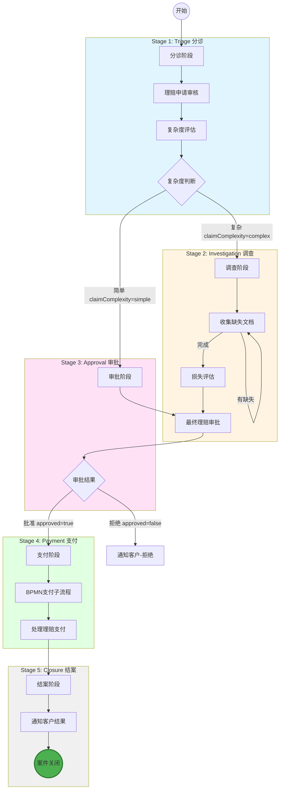
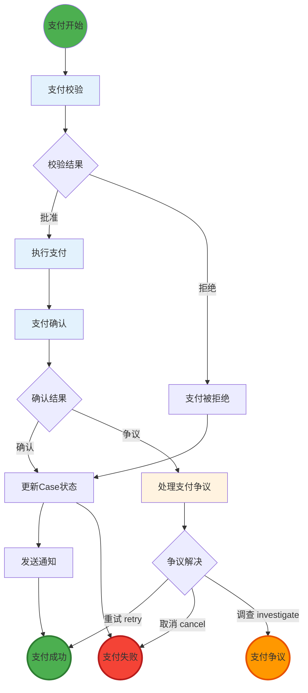
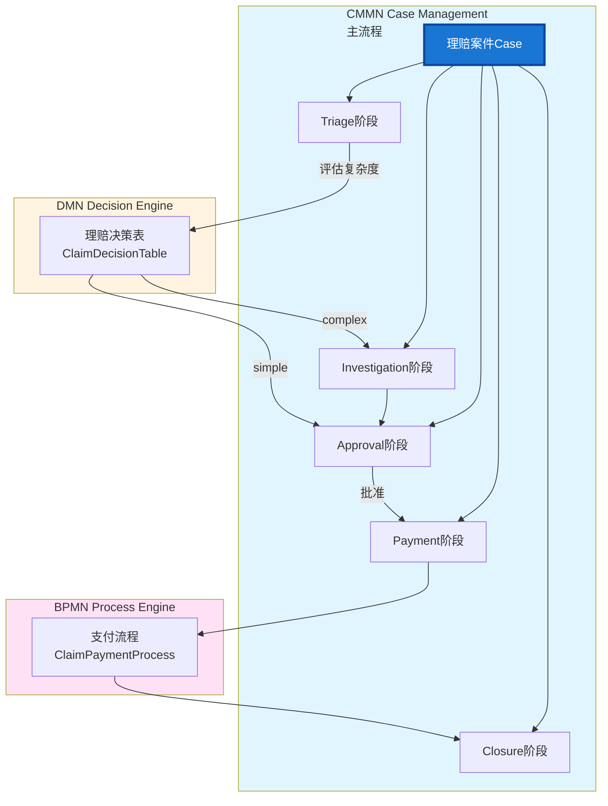

# 保险理赔系统 Demo

基于 **Flowable 7.x（CMMN + BPMN + DMN）** 的保险理赔系统 Demo，使用 **Spring Boot 3.5.x + Java 17 + PostgreSQL** 作为后端，**React JS + TypeScript + Ant Design** 作为前端管理控制台。

## 🎯 项目概述

这是一个完整的保险理赔管理系统，展示了 Flowable 7.x 的所有核心能力：

- **CMMN Case Management**：处理复杂的理赔案件生命周期
- **BPMN Process Engine**：执行支付等子流程
- **DMN Decision Engine**：基于规则的赔付决策
- **Job Executor**：异步任务处理
- **History Audit**：完整的审计跟踪

## 🏗️ 项目结构

```
flowable-demo/
├── backend/                    # Spring Boot 后端
│   ├── src/main/java/com/flowable/demo/
│   │   ├── domain/             # 领域层 (DDD)
│   │   │   ├── model/         # 实体模型
│   │   │   └── repository/    # 仓储接口
│   │   ├── service/            # 业务服务层
│   │   ├── web/                # REST API 层
│   │   │   └── rest/          # 业务 API
│   │   ├── admin/              # **Admin 管理模块** (NEW)
│   │   │   ├── model/         # Admin 领域模型
│   │   │   ├── adapter/       # Flowable 适配器
│   │   │   ├── service/       # Admin 业务服务
│   │   │   └── web/           # Admin REST API
│   │   └── config/            # 配置类
│   └── src/main/resources/
│       ├── cases/              # CMMN Case 定义
│       │   └── ClaimCase.cmmn
│       ├── dmn/                # DMN 决策表
│       │   └── ClaimDecisionTable.dmn
│       ├── processes/          # BPMN 流程定义
│       │   └── ClaimPaymentProcess.bpmn
│       └── application.yml    # 配置文件
├── frontend/                  # React 前端
│   ├── src/
│   │   ├── components/       # React 组件
│   │   ├── services/         # API 服务
│   │   ├── contexts/         # React Context
│   │   └── types/           # TypeScript 类型定义
│   ├── public/              # 静态资源
│   └── package.json         # 依赖配置
├── docs/                     # 文档
│   ├── admin-module-design.md              # Admin 模块设计文档
│   └── admin-module-implementation-summary.md  # Admin 实现总结
├── resources/                 # 资源文件
│   └── init-db.sql          # 数据库初始化脚本
└── README.md
```


## 🚀 快速开始

### 1. 环境要求

- **Java 17+**
- **Maven 3.8+**
- **Node.js 18+** (前端)
- **PostgreSQL** (本地安装)

### 2. 设置数据库

```bash
# 连接到本地 PostgreSQL
psql -U postgres

# 创建所需的数据库
CREATE DATABASE flowable_cline;
CREATE DATABASE flowable_demo;

# 验证数据库已创建
\l
```

**注意**: 确保本地 PostgreSQL 服务正在运行，默认连接配置为：
- 主机: localhost:5432
- 用户名: flowable_cline
- 密码: flowable_cline

### 3. 启动后端

```bash
cd backend
mvn clean install
mvn spring-boot:run
```

后端将在 `http://localhost:8080/api` 启动

### 4. 启动前端

```bash
cd frontend
npm install
npm start
```

前端将在 `http://localhost:3000` 启动

### 5. 访问应用

- **前端应用**: `http://localhost:3000`
- **API 文档**: `http://localhost:8080/api/swagger-ui.html`

## 📋 业务流程

### 理赔案件处理流程 (CMMN Case)



#### 流程阶段说明

| 阶段 | 任务 | 负责人 | 说明 |
|------|------|--------|------|
| **Triage 分诊** | 理赔申请审核 | claimAdjuster | 审核申请材料完整性 |
| | 复杂度评估 | DMN决策表 | 自动评估案件复杂度 |
| **Investigation 调查** | 收集缺失文档 | claimAdjuster | 循环收集直到完整 |
| | 损失评估 | damageAssessor | 评估实际损失金额 |
| **Approval 审批** | 最终理赔审批 | approverGroup | 基于规则的审批 |
| **Payment 支付** | 处理理赔支付 | paymentOfficer | 执行支付流程 |
| **Closure 结案** | 通知客户结果 | claimAdjuster | 发送案件结果通知 |

### 支付流程 (BPMN Process)



#### 支付流程节点说明

| 节点 | 类型 | 处理人/服务 | 说明 |
|------|------|-------------|------|
| 支付校验 | UserTask | paymentOfficer | 校验支付金额、收款人信息 |
| 执行支付 | ServiceTask | paymentService | 调用支付服务执行转账 |
| 支付确认 | UserTask | paymentOfficer | 确认支付交易成功 |
| 处理争议 | UserTask | paymentManager | 处理支付争议问题 |
| 更新状态 | ServiceTask | caseService | 更新理赔案件状态 |
| 发送通知 | ServiceTask | notificationService | 发送支付结果通知 |

### 决策规则 (DMN Decision Table)

```mermaid
flowchart LR
    subgraph Inputs [输入条件]
        A[保单类型<br/>policyType]
        B[理赔金额<br/>claimedAmount]
        C[保额<br/>coverageAmount]
        D[报案类别<br/>claimType]
        E[严重性<br/>severity]
    end
    
    subgraph DMN [DMN决策引擎]
        F[理赔决策表<br/>ClaimDecisionTable]
    end
    
    subgraph Outputs [输出结果]
        G[赔付方式<br/>paymentMethod]
        H[需要调查<br/>needInvestigation]
        I[人工审核<br/>needManualReview]
        J[审批级别<br/>approvalLevel]
        K[优先级<br/>priority]
        L[案件复杂度<br/>claimComplexity]
    end
    
    Inputs --> F
    F --> Outputs
    
    style A fill:#e3f2fd
    style B fill:#e3f2fd
    style C fill:#e3f2fd
    style D fill:#e3f2fd
    style E fill:#e3f2fd
    style F fill:#ffecb3,stroke:#ffa000,stroke-width:3px
    style G fill:#c8e6c9
    style H fill:#c8e6c9
    style I fill:#c8e6c9
    style J fill:#c8e6c9
    style K fill:#c8e6c9
    style L fill:#c8e6c9
```



#### 决策规则详情

| 规则 | 保单类型 | 理赔金额 | 严重性 | 赔付方式 | 需要调查 | 审批级别 | 复杂度 |
|------|---------|---------|--------|---------|---------|---------|--------|
| 1 | 车险 | ≤10,000 | LOW | 快速赔付 | 否 | 自动 | simple |
| 2 | 车险 | 10,001-50,000 | MEDIUM | 标准赔付 | 否 | 主管 | simple |
| 3 | 车险 | >50,000 | - | 分级赔付 | 是 | 经理 | complex |
| 4 | 财产险 | ≤20,000 | LOW | 标准赔付 | 否 | 主管 | simple |
| 5 | 财产险 | 20,001-100,000 | MEDIUM | 分级赔付 | 是 | 经理 | complex |
| 6 | 财产险 | >100,000 | - | 分级赔付 | 是 | 总监 | complex |
| 7 | 人身险 | ≤30,000 | LOW | 快速赔付 | 否 | 主管 | simple |
| 8 | 人身险 | 30,001-200,000 | MEDIUM | 分级赔付 | 是 | 经理 | complex |
| 9 | 人身险 | >200,000 | - | 分级赔付 | 是 | 总监 | complex |
| 10 | 任意 | - | - | 标准赔付 | 是 | 经理 | complex |
| 11 | 任意 | - | - | 分级赔付 | 是 | 经理 | complex |
| 12 | 任意 | - | HIGH/CRITICAL | 分级赔付 | 是 | 总监 | complex |
| 13 | 任意 | >保额 | - | 按保额赔付 | 是 | 经理 | complex |
| 14 | 默认 | - | - | 标准赔付 | 否 | 主管 | simple |

### 完整工作流架构图



#### 输入参数说明

**输入参数:**
- **policyType**: 保单类型（车险/财产险/人身险）
- **claimedAmount**: 理赔金额
- **coverageAmount**: 保额限制
- **claimType**: 报案类别（事故/盗窃/自然灾害等）
- **severity**: 严重性（LOW/MEDIUM/HIGH/CRITICAL）

**输出决策:**
- **paymentMethod**: 赔付方式（快速赔付/标准赔付/分级赔付/按保额赔付）
- **needInvestigation**: 是否需要调查（true/false）
- **needManualReview**: 是否需要人工审核（true/false）
- **approvalLevel**: 审批级别（自动/主管/经理/总监）
- **priority**: 优先级（普通/重要/紧急）
- **claimComplexity**: 案件复杂度（simple/complex）

## 🔧 技术栈

### 后端技术
- **Spring Boot 3.2.x** - 应用框架
- **Flowable 7.0.1** - 流程引擎
- **Spring Security** - 安全框架
- **Spring Data JPA** - 数据访问
- **PostgreSQL** - 关系数据库
- **Redis** - 缓存和会话
- **Lombok** - 代码简化
- **MapStruct** - 对象映射
- **SpringDoc OpenAPI** - API 文档

### 前端技术
- **React 18** - UI 框架
- **TypeScript** - 类型安全
- **Ant Design** - UI 组件库
- **React Context** - 状态管理
- **Axios** - HTTP 客户端

## 📊 数据模型

### 核心实体

1. **User** - 系统用户
2. **Role** - 用户角色
3. **InsurancePolicy** - 保险保单
4. **ClaimCase** - 理赔案件
5. **ClaimDocument** - 理赔文档
6. **ClaimHistory** - 理赔历史

### 角色定义

- **ADMIN** - 系统管理员
- **CLAIM_HANDLER** - 理赔处理员
- **CLAIM_AUDITOR** - 理赔审核员
- **CLAIM_MANAGER** - 理赔经理

## 🔐 默认账户

系统预置了以下测试账户（密码：`password`）：

| 用户名 | 角色 | 说明 |
|--------|------|------|
| admin | ADMIN | 系统管理员 |
| handler1 | CLAIM_HANDLER | 理赔处理员 |
| auditor1 | CLAIM_AUDITOR | 理赔审核员 |
| manager1 | CLAIM_MANAGER | 理赔经理 |

## 📝 API 端点

### Case 管理
- `POST /api/cases` - 创建理赔 Case
- `GET /api/cases` - 查询 Case 列表
- `GET /api/cases/{id}` - 获取 Case 详情
- `PUT /api/cases/{id}` - 更新 Case
- `DELETE /api/cases/{id}` - 删除 Case
- `POST /api/cases/{id}/assign` - 分配案件给用户
- `POST /api/cases/{id}/status` - 更新案件状态
- `POST /api/cases/{id}/approve` - 批准理赔案件
- `POST /api/cases/{id}/pay` - 支付理赔案件
- `GET /api/cases/by-status` - 根据状态查询案件
- `GET /api/cases/by-assignee` - 根据分配用户查询案件
- `GET /api/cases/by-policy/{policyId}` - 根据保单查询案件
- `GET /api/cases/search` - 搜索案件
- `GET /api/cases/my-cases` - 获取当前用户的案件
- `GET /api/cases/statistics` - 获取案件统计信息

### 任务管理
- `GET /api/tasks/my` - 我的任务
- `GET /api/tasks/all` - 所有任务
- `POST /api/tasks/{id}/complete` - 完成任务
- `POST /api/tasks/{id}/assign` - 分配任务

### 流程管理
- `GET /api/processes` - 查询流程定义
- `POST /api/processes/{key}/start` - 启动流程
- `GET /api/process-instances` - 查询流程实例

### 决策管理
- `POST /api/decisions/evaluate` - 执行 DMN 决策
- `GET /api/decisions/tables` - 查询决策表

### 用户管理
- `GET /api/users` - 用户列表
- `POST /api/users` - 创建用户
- `PUT /api/users/{id}` - 更新用户
- `POST /api/users/{id}/roles` - 分配角色

### **Admin 管理 & CMMN 可视化** (NEW)

#### 模型管理
- `GET /api/admin/models` - 查询模型列表(支持类型筛选)
- `GET /api/admin/models/{modelKey}` - 获取模型详情(包含所有版本和 XML)
- `POST /api/admin/models/deploy` - 部署模型(文件上传)

#### Case 运行态管理
- `GET /api/admin/cases` - 查询 Case 实例列表(支持多条件筛选)
- `GET /api/admin/cases/{caseInstanceId}` - 获取 Case 实例详情(包含 Plan Item Tree)
- `GET /api/admin/cases/{caseInstanceId}/visualization` - 获取 CMMN 可视化数据(CMMN XML + Plan Item 状态)
  - 返回 CMMN XML 用于 cmmn-js 渲染
  - 返回所有 PlanItem 实例状态（运行态 + 历史态）
  - 支持 Stage、Milestone、HumanTask 等所有 PlanItem 类型
- `POST /api/admin/cases/{caseInstanceId}/terminate` - 终止 Case
- `POST /api/admin/cases/{caseInstanceId}/suspend` - 挂起 Case
- `POST /api/admin/cases/{caseInstanceId}/resume` - 恢复 Case
- `POST /api/admin/cases/{caseInstanceId}/plan-items/{planItemInstanceId}/trigger` - 手动触发 Plan Item

#### Process 运行态管理
- `GET /api/admin/processes` - 查询 Process 实例列表
- `GET /api/admin/processes/{processInstanceId}` - 获取 Process 实例详情
- `GET /api/admin/processes/{processInstanceId}/diagram` - 获取流程图高亮数据
- `POST /api/admin/processes/{processInstanceId}/terminate` - 终止 Process
- `POST /api/admin/processes/{processInstanceId}/suspend` - 挂起 Process
- `POST /api/admin/processes/{processInstanceId}/resume` - 恢复 Process

#### 统计分析
- `GET /api/admin/statistics` - 获取系统统计信息(模型、部署、Case、Process)

### **CMMN Case 可视化功能** (NEW)

基于 **Flowable UI 6.8 设计思路**，实现了轻量级的 CMMN Case 运行状态可视化功能。

#### 设计原则

1. **前后端分离架构**
   - 后端：提供 CMMN XML 和运行态 PlanItem 状态数据
   - 前端：使用 cmmn-js 渲染模型并应用状态高亮

2. **静态模型 + 动态状态**
   - 静态模型：CMMN XML（通过 cmmn-js 渲染）
   - 动态状态：PlanItemInstance 数据（运行态 + 历史态）

3. **状态映射规则**

| PlanItem State | UI 表现 | CSS Class |
| -------------- | ------- | --------- |
| `active` | 绿色高亮边框 + 阴影 | `plan-item-active` |
| `available` | 灰色虚线边框 | `plan-item-available` |
| `completed` | 灰色边框 + 完成标识 ✓ | `plan-item-completed` |
| `terminated` | 红色边框 + 半透明 | `plan-item-terminated` |
| `suspended` | 黄色边框 + 淡色填充 | `plan-item-suspended` |

#### 核心组件

##### 后端：`CmmnCaseVisualizationDTO`

```java
public class CmmnCaseVisualizationDTO {
    private String caseInstanceId;
    private String caseDefinitionId;
    private String cmmnXml;              // CMMN XML 用于 cmmn-js
    private List<PlanItemStateDTO> planItems;  // 所有 PlanItem 状态
}
```

##### 后端：`PlanItemStateDTO`

```java
public class PlanItemStateDTO {
    private String id;
    private String planItemDefinitionId;  // 对应 CMMN XML elementId
    private String name;
    private String type;                 // HUMAN_TASK, STAGE, MILESTONE, etc.
    private String state;                // active, available, completed, etc.
    private String stageInstanceId;
    private String createTime;
    private String completedTime;
    private String terminatedTime;
}
```

##### 前端：`CmmnCaseVisualizer` 组件

```tsx
interface CmmnCaseVisualizerProps {
  caseInstanceId: string;
  height?: string;
  onPlanItemClick?: (planItem: PlanItemState) => void;
}
```

**核心功能：**
1. 使用 cmmn-js `NavigatedViewer` 渲染 CMMN 模型
2. 根据 `planItemDefinitionId` 映射到 SVG 元素 `data-element-id`
3. 根据状态应用对应的 CSS class
4. 支持点击节点查看 PlanItem 详情

#### 状态高亮逻辑

```typescript
// 核心算法
const applyStateHighlights = (planItems: PlanItemState[]) => {
  const elementRegistry = cmmnViewer.get('elementRegistry');
  
  // 创建映射表
  const stateMap = new Map<string, PlanItemState>();
  planItems.forEach(item => {
    stateMap.set(item.planItemDefinitionId, item);
  });
  
  // 遍历所有 SVG 元素并应用状态
  elementRegistry.getAll().forEach((element) => {
    const elementId = element.businessObject.id;
    const planItemState = stateMap.get(elementId);
    
    if (planItemState) {
      const gfx = elementRegistry.getGraphics(element);
      gfx.classList.add(getStateClass(planItemState.state));
    }
  });
};
```

#### 特殊处理

1. **Stage 节点**
   - 根据自身状态高亮
   - 背景色根据状态变化
   - 支持子节点嵌套展示

2. **Milestone 节点**
   - 达成后显示为 completed 状态
   - 圆形填充颜色更明显

3. **HumanTask / ProcessTask**
   - 圆角矩形样式
   - active 状态带绿色填充

#### 使用方式

**在 Case 详情页中使用：**

```tsx
import { CmmnCaseVisualizer } from './CmmnCaseVisualizer';

<CmmnCaseVisualizer
  caseInstanceId={caseInstanceId}
  height="600px"
  onPlanItemClick={(planItem) => {
    // 显示 PlanItem 详情弹窗
    Modal.info({
      title: `Plan Item: ${planItem.name}`,
      content: <PlanItemDetail planItem={planItem} />
    });
  }}
/>
```

#### CSS 样式示例

```css
/* Active 状态 - 绿色高亮 */
.plan-item-active > .djs-visual > * {
  stroke: #28a745 !important;
  stroke-width: 3px !important;
  filter: drop-shadow(0 0 4px rgba(40, 167, 69, 0.4));
}

/* Completed 状态 - 灰色 + 完成标识 */
.plan-item-completed > .djs-visual > * {
  stroke: #6c757d !important;
  stroke-width: 2px !important;
  opacity: 0.7;
}

/* Terminated 状态 - 红色 */
.plan-item-terminated > .djs-visual > * {
  stroke: #dc3545 !important;
  stroke-width: 3px !important;
  opacity: 0.6;
}

/* Suspended 状态 - 黄色 */
.plan-item-suspended > .djs-visual > * {
  stroke: #ffc107 !important;
  stroke-width: 3px !important;
}
```

#### 与 Flowable UI 6.8 的对比

| 特性 | Flowable UI 6.8 | 本实现 |
|------|---------------|--------|
| 模型渲染 | 自定义 SVG 库 | cmmn-js（标准） |
| 状态数据 | 后端生成高亮结果 | 后端只提供原始数据 |
| 状态高亮 | 后端注入 SVG | 前端 CSS class |
| 扩展性 | 依赖官方 UI | 完全可定制 |
| 依赖重量 | 重（包含整套 UI） | 轻量（仅可视化） |

#### 后续扩展方向

1. **Case Timeline**
   - 展示 Case 执行时间线
   - 显示 PlanItem 启动/完成时间

2. **Sentry 解释**
   - 可视化显示 Sentry 触发条件
   - 解释为什么某个 PlanItem 被激活

3. **实时更新**
   - WebSocket 推送状态变化
   - 实时刷新模型视图

4. **交互操作**
   - 在模型上直接触发 PlanItem
   - 拖拽调整 Case 流程

#### 架构优势

1. **清晰的职责分离**
   - 后端：数据提供者
   - 前端：表现层逻辑

2. **易于测试**
   - 后端 API 独立测试
   - 前端组件可单元测试

3. **技术栈可控**
   - 不依赖 Flowable UI 的技术栈
   - 可使用任意前端框架

4. **可移植性强**
   - 后端 API 可被任何客户端使用
   - 前端可替换为其他可视化库

## 🎯 演示数据

系统自动创建以下演示数据：

1. **5 条保单记录**
   - 车险保单：POL2024001, POL2024004
   - 财产险保单：POL2024002, POL2024005
   - 人身险保单：POL2024003

2. **4 个用户账户**
   - 不同角色的测试用户

3. **流程部署**
   - 自动部署 CMMN、BPMN、DMN 定义

## 🔍 监控和管理

### **Admin 管理模块** (NEW)
自定义的技术管理员控制台,提供完整的 Flowable 模型和运行态管理:

#### 功能特性
- **模型管理**: 查询、部署 CMMN/BPMN/DMN 模型
- **Case 管理**: 查询、监控、操作 Case 实例
  - CMMN 模型可视化（使用 cmmn-js）
  - Plan Item 运行状态高亮显示
  - Plan Item Tree 树形视图
- **Process 管理**: 查询、监控、操作 Process 实例
  - BPMN 流程图高亮显示
- **统计分析**: 系统运行状态统计

#### API 端点
```
# 模型管理
GET    /api/admin/models                    - 查询模型列表
GET    /api/admin/models/{modelKey}         - 获取模型详情
POST   /api/admin/models/deploy             - 部署模型

# Case 管理
GET    /api/admin/cases                     - 查询 Case 列表
GET    /api/admin/cases/{id}                - 获取 Case 详情
GET    /api/admin/cases/{id}/visualization  - 获取 CMMN 可视化数据
POST   /api/admin/cases/{id}/terminate      - 终止 Case

# Process 管理
GET    /api/admin/processes                 - 查询 Process 列表
GET    /api/admin/processes/{id}            - 获取 Process 详情
GET    /api/admin/processes/{id}/diagram    - 获取流程图高亮数据

# 统计
GET    /api/admin/statistics                - 获取系统统计
```

详细文档: `docs/admin-module-complete-summary.md`

### Flowable 内置管理界面
访问 Flowable 内置管理界面:
- `http://localhost:8080/api/flowable-ui/cmmn` - Case 管理
- `http://localhost:8080/api/flowable-ui/modeler` - 流程设计器
- `http://localhost:8080/api/flowable-ui/admin` - 系统管理

### 健康检查
- `http://localhost:8080/api/actuator/health` - 应用健康状态
- `http://localhost:8080/api/actuator/metrics` - 应用指标

## 🧪 测试

### 单元测试
```bash
cd backend
mvn test
```

### 集成测试
```bash
mvn verify -P integration-test
```

## 📈 扩展功能

### 已实现
- ✅ 完整的 DDD 领域模型
- ✅ Flowable 7.x 三引擎集成
- ✅ 复杂的 CMMN Case 流程
- ✅ BPMN 支付子流程
- ✅ DMN 决策表规则
- ✅ PostgreSQL 数据持久化
- ✅ Spring Security 安全控制
- ✅ OpenAPI 文档
- ✅ React 前端界面

### 待实现
- 🔄 实时通知系统
- 🔄 文件上传功能
- 🔄 邮件集成
- 🔄 报表统计
- 🔄 移动端适配

## 🤝 贡献指南

1. Fork 项目
2. 创建特性分支 (`git checkout -b feature/AmazingFeature`)
3. 提交更改 (`git commit -m 'Add some AmazingFeature'`)
4. 推送到分支 (`git push origin feature/AmazingFeature`)
5. 打开 Pull Request

## 📄 许可证

本项目采用 MIT 许可证 - 查看 [LICENSE](LICENSE) 文件了解详情。

## 📞 支持

如有问题或建议，请：

1. 查看 [Issues](../../issues) 页面
2. 创建新的 Issue 描述问题
3. 提供详细的复现步骤

---

**注意**：这是一个演示项目，用于展示 Flowable 7.x 的能力和最佳实践。在生产环境中使用前，请确保进行充分的测试和安全评估。
